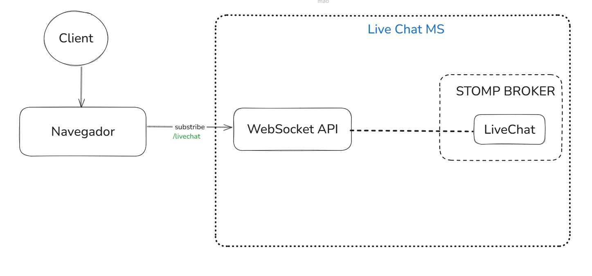
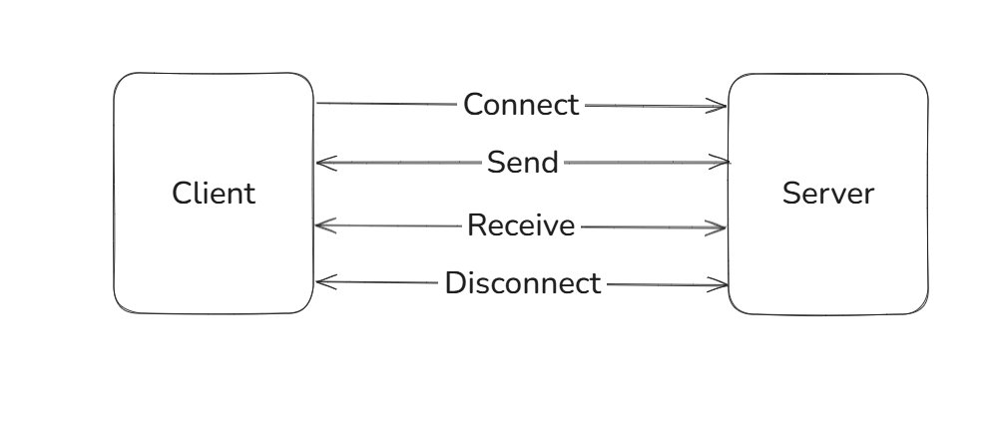

# Arquitetura implementada:

## Descrição:
Projeto de um liveChat com websocket desenvolvido em Java com Spring Boot.
Utilizado a arquitetura STOMP para comunicação entre o servidor e o cliente. Essa arquitetura foi escolhida por ser uma arquitetura de comunicação de mensagens simples e leve, que é baseada em um modelo de mensagens assíncronas.
Projeto desenvolvido com o intuito de criação de um template básico e prática de desenvolvimento de aplicações com websocket.

## Tecnologias utilizadas:
- Java 21
- Spring Boot
- STOMP